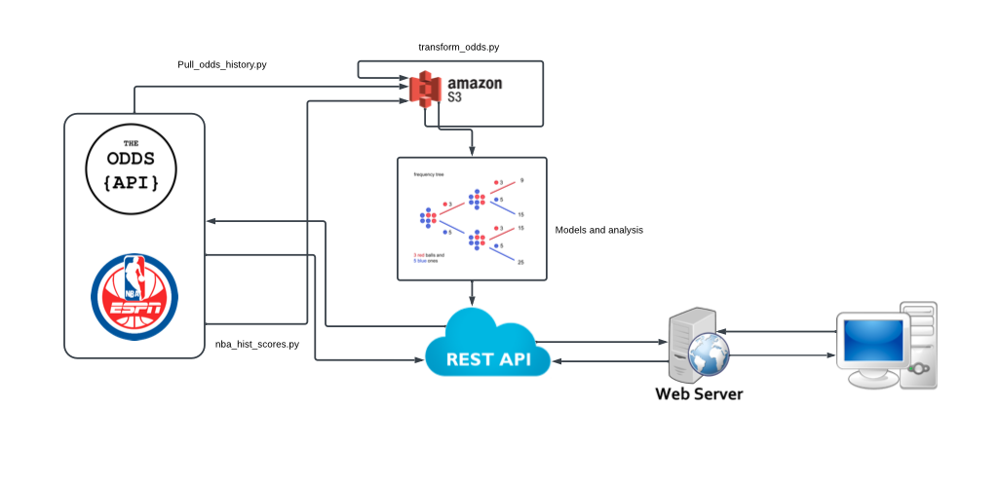

# Better Bets API

## Description
Repository for quantitatitve methods and data engineering in sports betting.

## Dependencies

- python 3.8 or greater
- Virtual Environment, link [here](https://towardsdatascience.com/creating-and-using-virtual-environment-on-jupyter-notebook-with-python-db3f5afdd56a) to set up virtual environments along with jupyter notebooks
- Jupyter Lab/Notebooks for story telling, analytical review, and testing ideas

## Organization
    .
    ├── archive                 # Unmaintained scripts that may no longer work with the current source files    
    ├── docsrc                  # Documentation generation source files
    ├── scripts                 # Up-to-date one-off scripts compatable with src
    ├── src                     # Source files
        ├── testing             # Unit testing
        ├── Notebooks           # Jupyter Notebooks for research, analysis, and storytelling
    ├── requirements.txt        # Required python packages
    └── README.md
    
## Data
Data is pulled using both the odds api and nba_api. Both links to the documentation are below.
- odds_api: https://the-odds-api.com/liveapi/guides/v4/
- nba_api: https://github.com/swar/nba_api/tree/master/docs/nba_api/stats/endpoints

The nba_api has a number of different endpoints that it uses to pull data. The above link is the
documentation for each of those endpoints.

## Example REST calls to get data

- To get the sports under the odds api run the following:
  - http://127.0.0.1:5000/sports to get the active sports
  - http://127.0.0.1:5000/sports?all=false to get the active sports
  - http://127.0.0.1:5000/sports?all=true to get both active and inactive sports
- To get the scores, pass the sports key that is returned from the above sports call. Example calls below
  - http://127.0.0.1:5000/scores?sport=americanfootball_cfl to get the scores for current day and prior
  - http://127.0.0.1:5000/scores?sport=americanfootball_cfl&daysFrom=3 get the scores for current day and 3 days prior
- To get the odds, pass the sports key and region for the odds. Regions can be us, us2, uk, au, and eu. The region must be passed.
  - http://127.0.0.1:5000/odds?sport=americanfootball_cfl&regions=us
- To get the number of requests remaining for your odds api
  - http://127.0.0.1:5000/requests
- To get the nba teams
  - http://127.0.0.1:5000/sports/nba/teams
- To get the nba players. The current version includes both inactive and active players
  - http://127.0.0.1:5000/sports/nba/players

## Data Architecture

